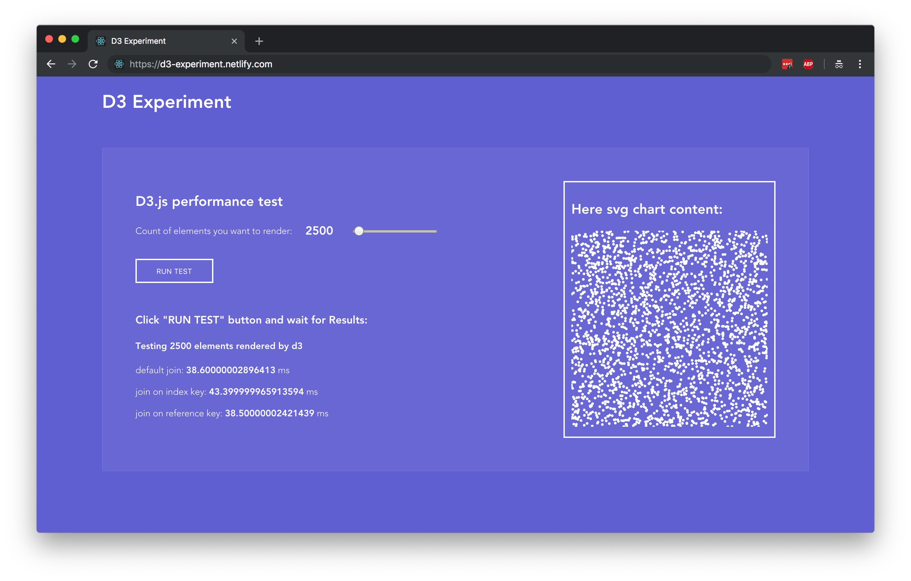

# d3-experiment

 [](http://donate.geekplux.com)

> Some experiments and tests for using d3.

There are some cases:

### Rendering performance test



## Usage

```bash
git clone
yarn install
yarn start
```

## Contributing

1. Fork it!
2. Create your feature branch: `git checkout -b my-new-feature`
3. Commit your changes: `git commit -am 'Add some feature'`
4. Push to the branch: `git push origin my-new-feature`
5. Submit a pull request :D


## Author

**d3-experiment** © [geekplux](https://github.com/geekplux), Released under the [MIT](./LICENSE) License.<br>
Authored and maintained by geekplux with help from contributors ([list](https://github.com/geekplux/d3-experiment/contributors)).

> [github.com/geekplux](https://github.com/geekplux) · GitHub [@geekplux](https://github.com/geekplux) · Twitter [@geekplux](https://twitter.com/geekplux)
